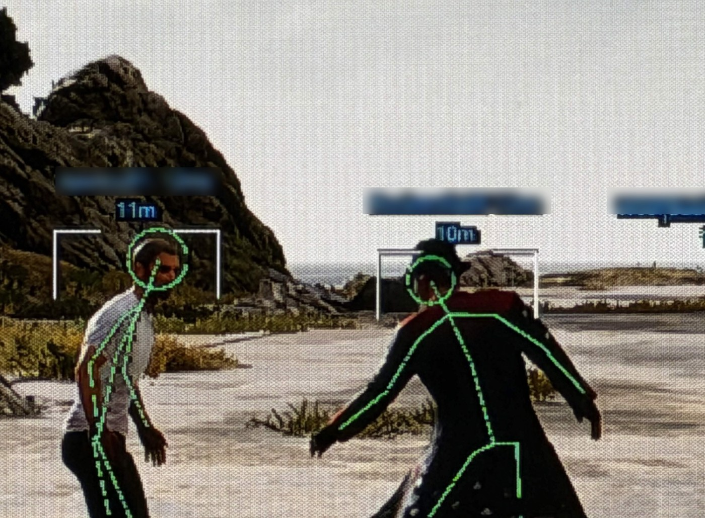
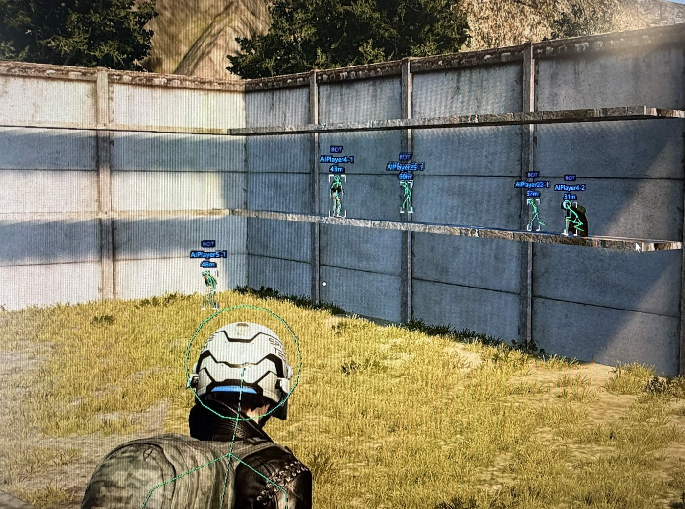
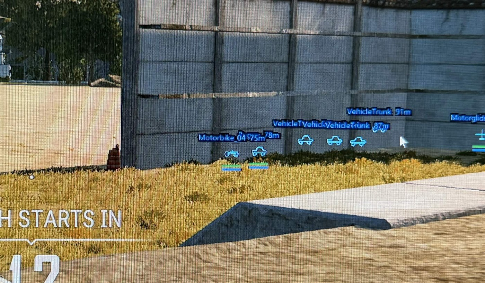
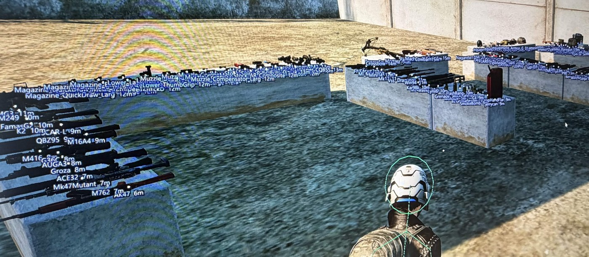
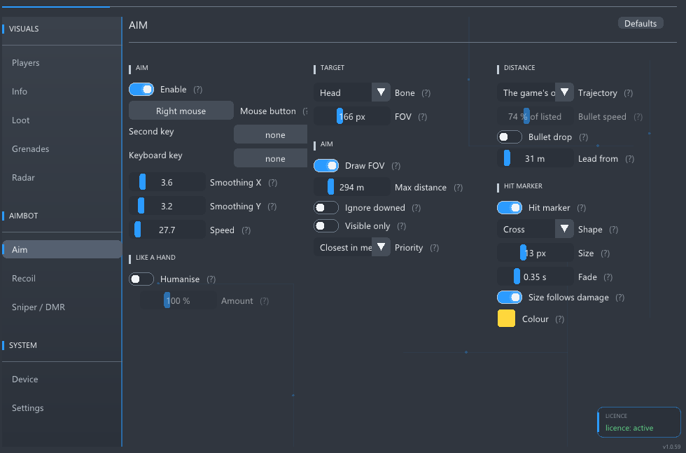
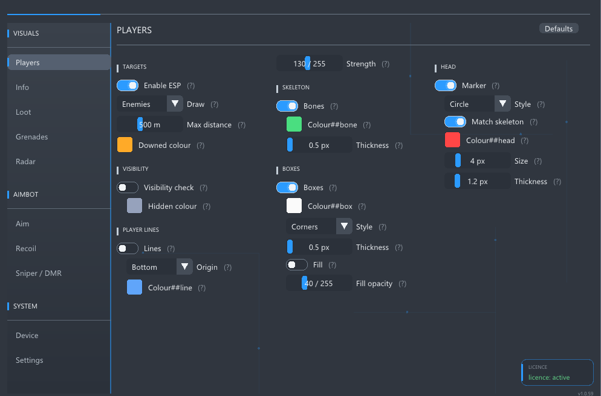

# PUBG DMA Vision

**The complete PUBG DMA solution.** Runs on a second machine and reads the
game over a DMA card.

  

## Players

- Skeleton, box and head marker, drawn from the real bone positions
- Box in three styles: full, corners, or a filled wash
- Head marker as a circle, a square or a dot
- Snap lines, with the origin you pick
- Name, distance, team number, ping
- Team colours, so two squads fighting are two colours
- A colour of its own for a knocked player
- A colour of its own for a player you cannot see
- Weapon in his hands and what is fitted to it
- Player or bot, marked
- Warning when somebody is aiming at you
- Spectator count
- Drivers and passengers drawn like anybody else
- One dial for how strong all of it is drawn

## Vehicles

- Drawn as what they are: two wheels, four wheels, a hull, a wing
- Name and distance
- Health bar and fuel bar, each optional
- One drawing per vehicle, however many parts the game keeps for it

## Loot

- Every item by its real name
- Armour, helmets and bags with their level
- Attachments by what they are
- Weapons, ammo, scopes, healing and throwables each on their own switch
- A filter to show only the guns you actually pick up
- Crates and airdrops with their contents listed underneath
- Range and font size set by you

## Aim

- Bone: head, neck, chest or pelvis
- Field of view, drawn on screen if you want it
- Maximum distance
- Priority: closest to the crosshair, or closest in metres
- Visible only, and ignore downed
- Smoothing kept apart for sideways and vertical
- Humanise, for a path that is not perfectly straight
- Bullet lead and bullet drop taken from the game's own trajectory data, per
  weapon and per barrel
- Snipers and DMRs on their own page, or left entirely to your hand

## Recoil

- Strength near and strength far, with the distance that decides between them
- Light weapons handled apart from rifles
- One setting covers every scope
- Runs only while the aim key is held and the trigger is down
- MAKCU over serial, or kmbox net over the network

## Grenades, radar, the zone

- Arc, landing point, blast radius and fuse timer
- Your own throw shown before you let go
- Radar with everyone around you, the safe zone and the blue zone
- Distance to the edge of the zone

## Everything is yours to set

**63 switches, 46 sliders, 20 colour pickers, 15 dropdowns, 8 hotkeys.**

- Every colour, every font size, every thickness, every range
- A Defaults button on each page, which touches only that page
- A question mark on every setting saying what it does in plain words
- Fixed size, no scrollbars, everything on one screen
- Hotkeys work from the gaming PC's keyboard as well

<b>Every setting, and what it runs between</b>

**Players**

| | |
|---|---|
| Max distance | 0 to 1500 m |
| Strength, everything drawn on a player | 20 to 255 |
| Skeleton thickness | 0.5 to 4.0 px |
| Box thickness | 0.5 to 4.0 px |
| Box fill opacity | 0 to 160 |
| Head marker size | 2 to 14 px |
| Head marker thickness | 0.5 to 5.0 px |
| Text size | 9 to 24 px |

Draw: enemies only, or everyone. Box style: full, corners, filled. Head
marker: circle, square, dot, and either its own colour or the skeleton's.
Snap line origin: top, bottom, left, right, or the middle of the screen.

**Loot**

| | |
|---|---|
| Range | 20 to 1000 m |
| Text size | 9 to 30 px |

Kinds on their own switches: weapons, scopes, attachments, ammo, healing,
throwables, everything else. Armour, helmets and bags by level, 1, 2 and 3
separately. A weapon list to tick only what you care about. A hotkey to turn
the whole layer on and off.

**Vehicles, crates, airdrops**

| | |
|---|---|
| Vehicle text size | 9 to 30 px |
| Crate text size | 9 to 30 px |
| Airdrop range | 20 to 2000 m |
| Airdrop text size | 9 to 30 px |

Vehicles: shape on or off, health bar, fuel bar, colour, hotkey. Crates: show
what is inside. Airdrops: their own range, colour and hotkey.

**Grenades**

| | |
|---|---|
| Range | 20 to 500 m |
| Text size | 9 to 30 px |
| Near means | 2 to 30 m |

Held in hand, thrown, trajectory, landing point, blast radius, fuse timer,
each on its own switch. Frag, molotov, smoke and flash can be turned on and
off separately. The throw helper colours your own arc green or white by
whether it lands where you are looking.

**Radar**

| | |
|---|---|
| Size | 120 to 600 px |
| Range | 50 to 2000 m |
| Side inset | 0 to 2000 px |
| Top and bottom inset | 0 to 1400 px |

Corner of your choice. Colours for the frame, your team, enemies, the safe
zone and the blue zone. Zones and the distance to the edge on their own
switches.

**Aim**

| | |
|---|---|
| Field of view | 10 to 500 px |
| Max distance | 10 to 1500 m |
| Smoothing sideways | 1.0 to 20.0 |
| Smoothing vertical | 1.0 to 20.0 |
| Speed, counts per degree | 1.0 to 400.0 |
| Humanise amount | 0 to 300 % |
| Lead from | 0 to 400 m |

Bone: head, neck, chest, pelvis. Priority: closest to the crosshair, or
closest in metres. Aim key: any mouse button, a second key, or a keyboard
key. Trajectory: the game's own data, or the older estimate.

Devices: MAKCU down a serial cable, with the COM port found for you, or
kmbox net over the network with its own address, port and MAC. A test move on
the page proves the connection before you rely on it.

**Sniper and DMR**

Their own field of view, max distance, smoothing, speed, lead and bone, all
over the same ranges as above, or the whole page switched off so long guns
are left to you.

**Recoil**

| | |
|---|---|
| Strength, near | 0 to 600 |
| Strength, far | 0 to 600 |
| The distance between them | 5 to 300 m |

**The overlay itself**

| | |
|---|---|
| Menu brightness | 60 to 180 % |
| HUD scale | 80 to 220 % |
| Frame rate cap | 0 to 360 fps |
| Overlay lead | 0 to 150 ms |
| Stroke boost for the fuser | 80 to 250 % |

Menu key and panic key, both from either keyboard. Hide from recording.
Heavy outline for text on a bright background. A layer list so you can watch
a hotkey take effect.

## What you need

- Two PCs
- A DMA card
- A MAKCU, or a kmbox net
- An HDMI fuser
- Both machines on the same resolution and the same refresh rate

<b>Game settings you must have</b>

**Controls, Mouse Sensitivity**

| | |
|---|---|
| General Sensitivity | 50 |
| Vertical Sensitivity Multiplier | 1 |
| Aim Sensitivity | 50 |
| ADS Sensitivity | 50 |
| Scoping Sensitivity | 50 |
| Universal Sensitivity for All Scopes | ENABLE |

**Controls, Key Input Method** - ADS set to **Hold**, not Toggle.

**Key Bindings, Combat** - ADS on the **right mouse button**.

- Universal sensitivity on, with all five the same, means one mouse speed
  covers every sight. With it off, each scope has its own and the aim is right
  on one of them and wrong on the rest.
- Vertical multiplier at 1 keeps up and down the same as left and right.
- ADS on hold, because the aim and the recoil run only while the key is held.
  On toggle the game stays aimed while the button is already released.

Set these once, then set Speed on the Aim page.

## Getting a key

1. **[Join the Discord](https://discord.gg/Hd7vDXG3aQ)** and open a ticket
2. Say hello
3. The loader and your key are handed to you there

The loader keeps itself and everything else up to date.

## Asked most often

**Anything to calibrate?**
No. Set your mouse speed once and that is all.

**Is it really free?**
Yes.
